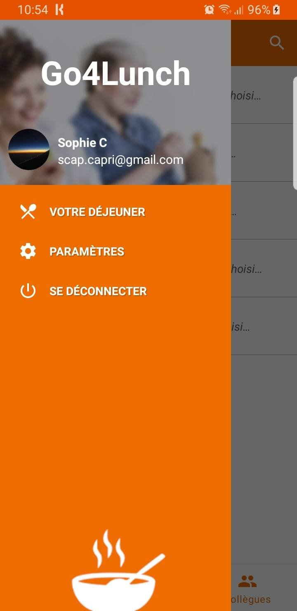
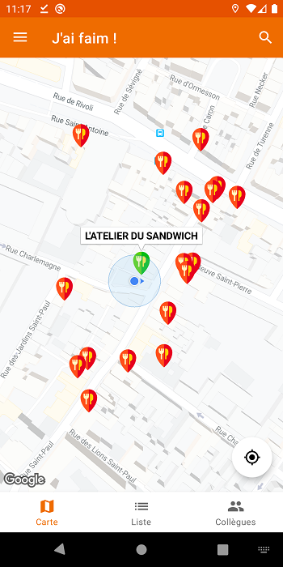
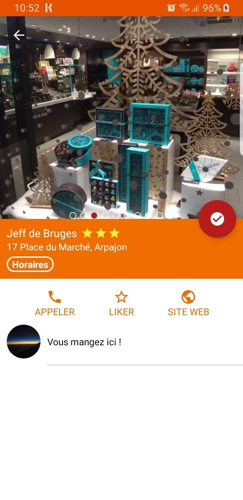
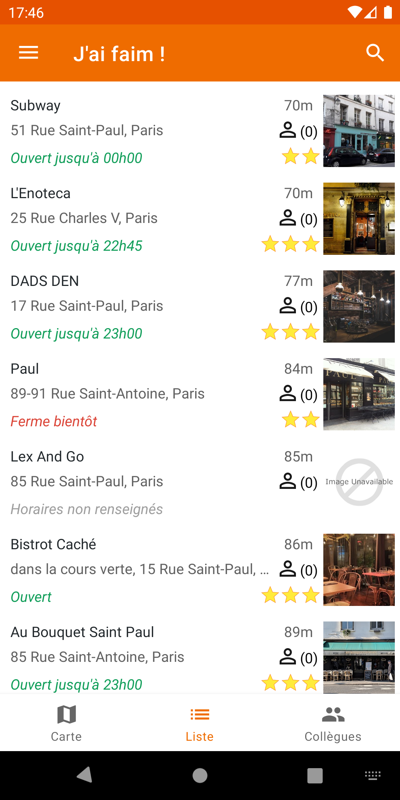
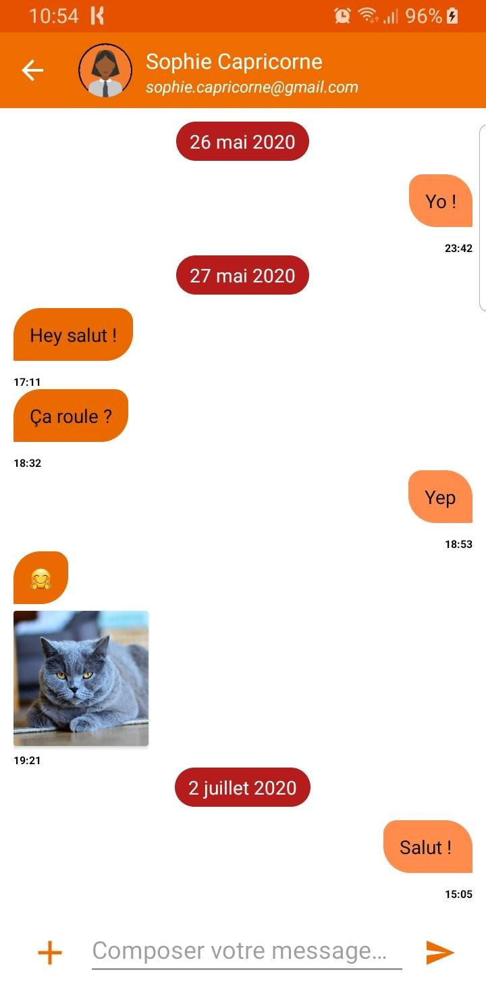
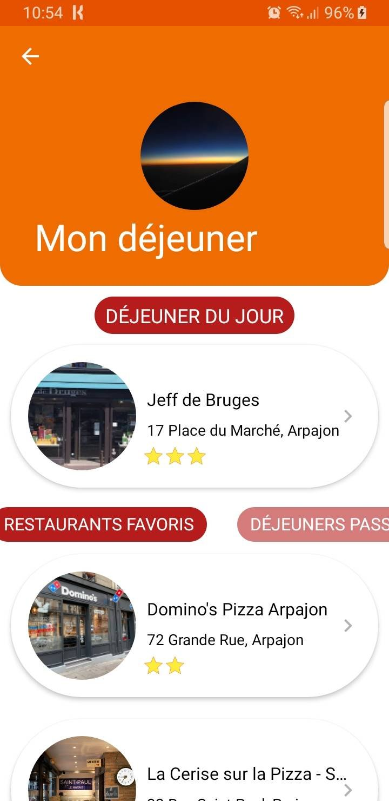
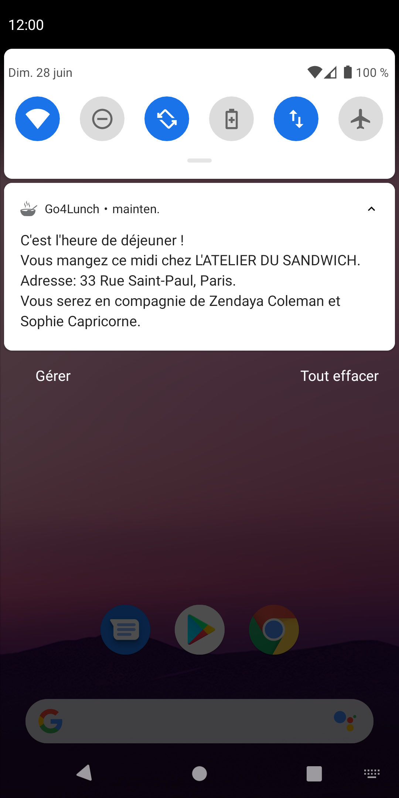

***[not maintained]***
# **Go4Lunch** 
**School project**

Go4Lunch is an app for co-workers.

Functionalities :
- Look for a restaurant around you and select it to let your collegues know where you'll be eating for lunch.
- See where each of your colleagues will be eating, in a list, and on the map.  
- Receive a notification a few moments before lunch to let you know where you will be having lunch and with wich colleagues.
- Add restaurants to favorites.
- Look for a restaurant by name.

Bonus:
- Send messages to your colleagues directly in the app.
- See an history of all the restaurants you've had lunch at before.
- Look for a colleague by name.

## Screenshots
.

.
.
.

## Build project

To build the project you will need a Google API key, an Algolia API key and id, that you will write in your"gradle.properties" file like so:

- API_KEY=<XXXX>
- ALGOLIA_API_KEY=<XXXX>
- ALGOLIA_APP_ID=<XXXX> 

 You will also need to get the "google-services.json" file through Firebase, and place it in the "app" file of the project.

For more informations :
- https://firebase.google.com/docs/android/setup
- https://www.algolia.com

## Library

- Firebase
- FirebaseUI
- Places
- Glide
- Retrofit
- WorkManager
- Algolia
- EasyPermissions
- Gson
- Espresso
- AndroidX

